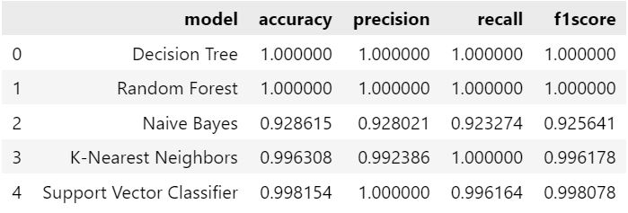
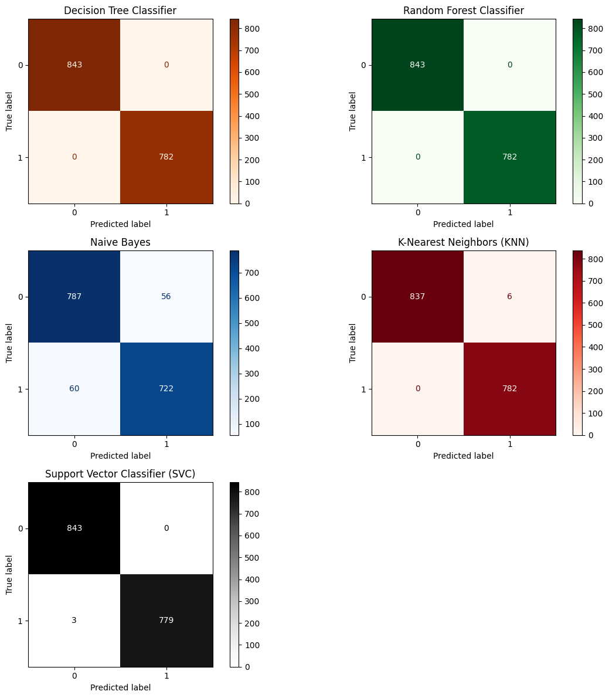
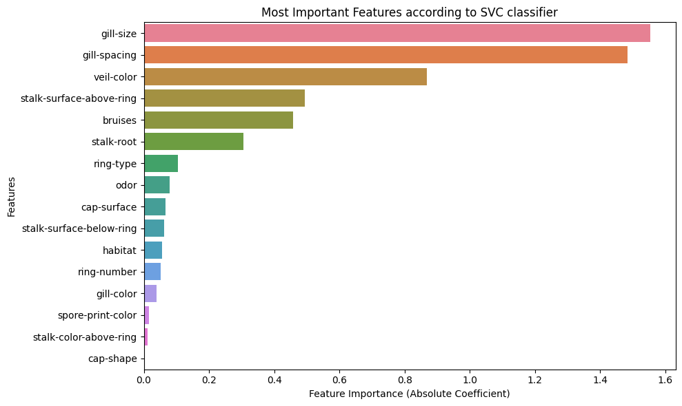

# Mushroom Classification Using Machine Learning

## Abstract

This project aims to classify mushrooms as either edible or poisonous based on their visible and physical characteristics using machine learning algorithms. Using a dataset containing 8124 mushroom entries with 22 categorical features, various models were trained and evaluated, including Decision Tree, Random Forest, Naive Bayes, K-Nearest Neighbors, and Support Vector Classifier. Support Vector Classifier (SVC) achieved the best overall performance with an accuracy of 99.8%. Key features contributing to classification were identified, such as gill size, gill spacing, bruises, stalk surface above the ring, and veil color. The outcomes suggest machine learning models can be powerful tools in mushroom identification, potentially aiding foragers and reducing the risk of consuming poisonous mushrooms.

## Table of Contents

- [Introduction](#introduction)
- [Objectives](#objectives)
- [Dataset Overview](#dataset-overview)
- [Pre-processing Steps](#pre-processing-steps)
- [Classification Algorithms](#classification-algorithms)
- [Comparing Performance Using Classification Metrics Table](#comparing-performance-using-classification-metrics-table)
- [Comparing Performance Using Confusion Matrix](#comparing-performance-using-confusion-matrix)
- [Discussion](#discussion)
- [Feature Selection Using Linear SVC](#feature-selection-using-linear-svc)
- [Conclusion](#conclusion)

## Introduction

It is difficult to distinguish between edible and poisonous mushrooms due to their high similarities such as similar color, odor, texture and common habitat. Misidentification and consumption of poisonous mushroom can lead to serious health issue or even death. Machine learning offers a data-driven approach to identify between edible and poisonous mushrooms based on visible and physical attributes.

## Objectives

- To determine the most suitable model for classifying mushrooms.
- To identify which features most influence the classification between edible and poisonous mushrooms.

## Dataset Overview

### Source

The dataset was provided by my instructor as a part of the course project. The original source is unknown. But I did find a [mushroom dataset in Kaggle](https://www.kaggle.com/datasets/uciml/mushroom-classification?datasetId=478&sortBy=voteCount) which matches the one I worked on.

### Size

- Total number of entries = 8124
- Total number of columns = 23

### Data Type

All columns in the dataset were of type object, which means they contained categorical string values.

### Target Variable (Dependent Variable)

- class (edible=e, poisonous=p)

### Features (Independent Variables)

- Total number of features = 22

1.	cap-shape (bell=b, conical=c, convex=x, flat=f, knobbed=k, sunken=s)
2.	cap-surface (fibrous=f, grooves=g, scaly=y, smooth=s)
3.	cap-color (brown=n, buff=b, cinnamon=c, gray=g, green=r, pink=p, purple=u, red=e, white=w, yellow=y)
4.	bruises (bruises=t, no=f)
5.	odor (almond=a, anise=l, creosote=c, fishy=y, foul=f, musty=m, none=n, pungent=p, spicy=s)
6.	gill-attachment (attached=a, descending=d, free=f, notched=n)
7.	gill-spacing (close=c, crowded=w, distant=d)
8.	gill-size (broad=b, narrow=n)
9.	gill-color (black=k, brown=n, buff=b, chocolate=h, gray=g, green=r, orange=o, pink=p, purple=u, red=e, white=w, yellow=y)
10.	stalk-shape (enlarging=e, tapering=t)
11.	stalk-root (bulbous=b, club=c, cup=u, equal=e, rhizomorphs=z, rooted=r, missing=?)
12.	stalk-surface-above-ring (fibrous=f, scaly=y, silky=k, smooth=s)
13.	stalk-surface-below-ring (fibrous=f, scaly=y, silky=k, smooth=s)
14.	stalk-color-above-ring (brown=n, buff=b, cinnamon=c, gray=g, orange=o, pink=p, red=e, white=w, yellow=y)
15.	stalk-color-below-ring (brown=n, buff=b, cinnamon=c, gray=g, orange=o, pink=p, red=e, white=w, yellow=y)
16.	veil-type (partial=p, universal=u)
17.	veil-color (brown=n, orange=o, white=w, yellow=y)
18.	ring-number (none=n, one=o, two=t)
19.	ring-type (cobwebby=c, evanescent=e, flaring=f, large=l, none=n, pendant=p, sheathing=s, zone=z)
20.	spore-print-color (black=k, brown=n, buff=b, chocolate=h, green=r, orange=o, purple=u, white=w, yellow=y)
21.	population (abundant=a, clustered=c, numerous=n, scattered=s, several=v, solitary=y)
22.	habitat (grasses=g, leaves=l, meadows=m, paths=p, urban=u, waste=w, woods=d)

## Pre-processing Steps

The following steps were performed in this project:

### 1) Checked for Null or Duplicate Entries
The dataset was examined using .info() function to confirm that there were no null values. Additionally, .duplicated().sum() function was used to verify the absence of duplicate records.

### 2) Handled Missing Values
The stalk-root column contained 2480 entries marked with a '?', indicating missing data. These were replaced with the label 'unknown' so that the model can still process the data without discarding useful records.

### 3) Label Encoding
Since all columns in the dataset consisted of categorical string values, label encoding was applied to convert these string values into numerical format, making them understandable by machine learning algorithms. For instance, the target variable 'class', which had values 'e' (edible) and 'p' (poisonous), was encoded as 0 for edible and 1 for poisonous.

### 4) Independent and Dependent Split
The dataset was divided into two parts:
- X (independent variables) : which contains all the input features used to make predictions. These exclude the target feature ('class').
- Y (dependent variable) : which contains only the target feature ('class'), which we want the model to predict (Example: whether a mushroom is edible or poisonous).

### 5) Train-Test Split
The dataset was split into training and testing sets using an 80-20 split with train_test_split() function.
- 80% of the data was used for training the model (X_train, y_train)
- 20% of the data was used for testing the model's performance (X_test, y_test)

The 20% unseen test data i.e. X_test was then passed to the trained model to create predictions (approximate value). These predictions were compared with the ground truth (exact value) i.e. y_test to evaluate how well the model performed.

## Classification Algorithms

To classify mushrooms as edible or poisonous, multiple supervised machine learning models were selected and trained on the dataset. The models used include:
- Decision Tree Classifier
- Random Forest Classifier
- Gaussian Naive Bayes
- K-Nearest Neighbors (KNN)
- Support Vector Classifier (SVC)

## Comparing Performance Using Classification Metrics Table

**Accuracy**

Accuracy = $\frac{TP+TN}{TP+TN+FP+FN}$

Accuracy is the ratio of correct classification and total number of classification (total number of records).

**Precision**

Precision = $\frac{TP}{TP+FP}$

Precision means of all mushrooms predicted as poisonous, how many were actually poisonous.

**Recall**

Recall = $\frac{TP}{TP+FN}$

Recall means of all the actually poisonous mushrooms, how many were correctly predicted.

**F1 Score**

F1 Score = $2\times \frac{precision\times recall}{precision + recall}$

F1score is the harmonic mean of precision and recall.

## Comparing Performance Using Confusion Matrix

Confusion matrix visually shows us correct vs incorrect predictions in numbers.

- **TP** (True Positives): how many mushrooms were correctly predicted as poisonous (actual = 'p', predicted = 'p').
- **FP** (False Positives): how many edible mushrooms were incorrectly predicted as poisonous (actual = 'e', predicted = 'p').
- **FN** (False Negatives): how many poisonous mushrooms were incorrectly predicted as edible (actual = 'p', predicted = 'e').
- **TN** (True Negatives): how many mushrooms were correctly predicted as edible (actual = 'e', predicted = 'e').

**Decision Tree and Random Forest models**
- They correctly predicted 843 poisonous mushrooms.
- They incorrectly predicted 0 poisonous mushrooms as edible mushrooms.
- They incorrectly predicted 0 edible mushrooms as poisonous mushrooms.
- They correctly predicted 782 edible mushrooms.

**Gaussian Naive Bayes**
- It correctly predicted 787 poisonous mushrooms.
- It incorrectly predicted 56 poisonous mushrooms as edible mushrooms.
- It incorrectly predicted 60 edible mushrooms as poisonous mushrooms.
- It correctly predicted 722 edible mushrooms.

**K-Nearest Neighbors (KNN)**
- It correctly predicted 837 poisonous mushrooms.
- It incorrectly predicted 6 poisonous mushrooms as edible mushrooms.
- It incorrectly predicted 0 edible mushrooms as poisonous mushrooms.
- It correctly predicted 782 edible mushrooms.

**Support Vector Classifier (SVC)**
- It correctly predicted 843 poisonous mushrooms.
- It incorrectly predicted 0 poisonous mushrooms as edible mushrooms.
- It incorrectly predicted 3 edible mushrooms as poisonous mushrooms.
- It correctly predicted 779 edible mushrooms.

## Discussion

- Decision Tree and Random Forest models got 100% on all the metrics. These models also made all correct predictions of edible and poisonous. This usually means these two models have memorized the training data instead of learning general patterns. This is called overfitting. This leads to models not working well on new or real-world data. Because of this, we will not consider Decision Tree and Random Forest when choosing the best model.
- Gaussian Naive Bayes had relatively lower accuracy and misclassified several poisonous mushrooms as edible. This could be risky in a real-world application, where safety is critical.
- K-Nearest Neighbors (KNN) showed high accuracy with very few misclassifications, but still incorrectly predicted 6 poisonous mushrooms as edible.
- Support Vector Classifier (SVC) correctly predicted 843 poisonous and 779 edible mushrooms, with zero poisonous mushrooms misclassified as edible, making it the safest and most reliable model with near-perfect results with minimal false classifications.

## Feature Selection Using Linear SVC

Important features were selected using Linear Support Vector Classifier to find out which features are the most influential in determining whether a mushroom is poisonous or edible.

According to the SVC model, the top features that contribute to a mushroom being poisonous are its gill-size, gill-spacing, veil-color, stalk-surface-above-ring and bruises.

## Conclusion

This project successfully evaluated various machine learning models for mushroom classification. Therefore, to conclude this analysis, if I were exploring mushrooms in the forest and had an algorithm to help me determine whether a mushroom is poisonous or edible, I would rely on the Support Vector Classifier (SVC) model. I would pay close attention to key mushroom features:
- gill size
- gill spacing
- veil color
- stalk surface above the ring
- bruises

These features were found to be the most influential in determining whether a mushroom is poisonous or edible.

Check out analysis on Python Jupyter notebook [mushroom-classification.ipynb](https://github.com/NitikaMaharjan/mushroom-classification/blob/main/mushroom-classification.ipynb).

